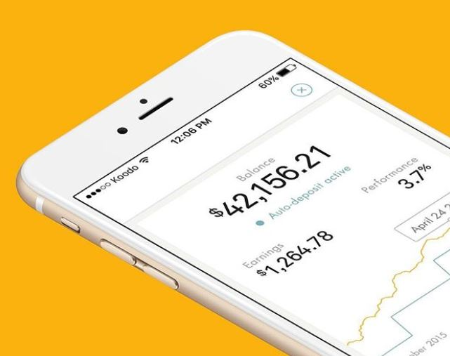

# TITLE: WealthSimple Inc Case Study
### Overview and origin: Wealthsimple Inc. is a Canadian online investment management services company. It was founded in September 2014 by Michael Katchen and is headquartered in Toronto. It is currently the best Robo-Advisory in wealth management FinTech company in Canada.

* Name of company
WealthSimple

* When was the company incorporated?
September 2014

* Who are the founders of the company? 
Michael Katchen

* How did the idea for the company (or project) come about?

Prior to founding Wealthsimple, Michael Katchen worked for 1000Memories, a Silicon Valley-based startup. After Ancestry.com bought 1000Memories in 2012, Katchen developed a spreadsheet with tips to help his colleagues set up investment portfolios. Interest in the spreadsheet helped inspire the idea for Wealthsimple. Katchen started investing at an early age and understood the importance and benefits of investing and building portfolios at a young age. So a part of his idea was also to focus on and get milennials to do the same.

* How is the company funded? How much funding have they received?

It initially raised financing from investors Eric Kirzner, Joe Canavan, and Roger Martin in May of 2014. In April 2015 and 2016, the company received a total of $30 million in Series A funding from Power Financial Corporation. And through these 7 years, Wealthsimple has received over CAD 380 million in funding. Recently they raised another $114 million from investors like TCV, a Menlo Park, Calif.-based equity investor, alongside other U.S.-based venture fund companies such as Greylock Partners, Meritech Capital Partners, Two Sigma Ventures Investments, and an existing investor, Munich-based Allianz X.

## Business Activities:

* What specific financial problem is the company or project trying to solve? 
-Robo-Advisor Retirement Solutions
-Making smart investing simple, transparent, and low-cost for everyone.

* Who is the company's intended customer?  Is there any information about the market size of this set of customers? 
It’s mainly focused on Millenials. About 42% of millennial are into investing these days and market size is massive.

* What solution does this company offer that their competitors do not or cannot offer? (What is the unfair advantage they utilize?)
-no minimum account balance, free portfolio analysis, multiple SRIs,  a halal-investing portfolio  which complied with Islamic law is a standout offering. (WS best in values based investing category)

* Which technologies are they currently using, and how are they implementing them? (This may take a little bit of sleuthing–– you may want to search the company’s engineering blog or use sites like Stackshare to find this information.)

## Landscape:

* What domain of the financial industry is the company in?  Wealth management , Robo Advising/ Personal Finance, Wealthbar, Justwealth, ModernAdvisor

* What have been the major trends and innovations of this domain over the last 5-10 years? 

Robo advisory in wealth management industry has experienced explosive growth in then past 5-7 years. Client assets managed by robo-advisors hit $60 billion at year-end 2015 and are projected to reach US$2 trillion by 2020 and $7 trillion worldwide by 2025.

* What are the other major companies in this domain?
RBC invest ease, BMO smart folio, Betterment, SoFi, Wealth-front.

## Results

* What has been the business impact of this company so far? 

Wealthsimple has been successful in engaging a lot of millennials into building portfolios with their free trading of ETFs and stocks. Their products based on values have also been a big hit amongst people looking to build halal-compliant portfolios. With their success in these areas, Wealthsimple has reached “unicorn” status with a valuation of $ 1.4 billion and are now planning insurance and mortgage products.

* What are some of the core metrics that companies in this domain use to measure success? How is your company performing, based on these metrics?

* How is your company performing relative to competitors in the same domain?
WealthsSimple is currently doing the best when com pared to other Canadian FinTech companies. 

## Recommendations

* If you were to advise the company, what products or services would you suggest they offer? (This could be something that a competitor offers, or use your imagination!)

* Why do you think that offering this product or service would benefit the company?

* What technologies would this additional product or service utilize?

* Why are these technologies appropriate for your solution?

***Sources:***
- [wealthsimple](https://www.wealthsimple.com/en-ca/)
- [Wikipedia](https://en.wikipedia.org/wiki/Wealthsimple)
- [investment executive article](https://www.investmentexecutive.com/news/industry-news/wealthsimple-raises-114-million-in-financing-round/)
